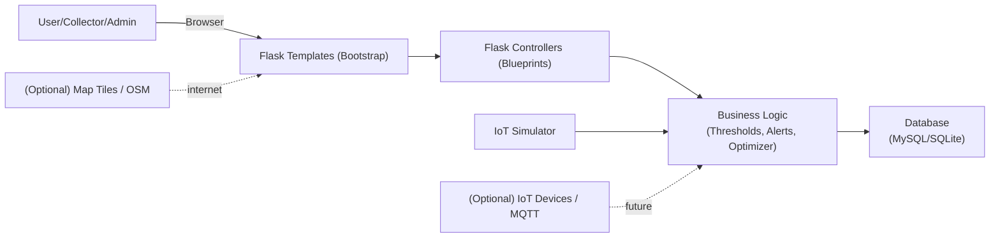

# System Architecture

## Components
- **Web UI (Bootstrap + Jinja):** dashboards, bin monitoring, map views, admin forms.
- **Flask Backend:** authentication, CRUD APIs, route optimization, reporting.
- **Database (MySQL/SQLite):** persistent store for bins, readings, routes, alerts, events.
- **IoT Simulation:** generates sensor readings to emulate real bins.

## Diagram

## Notes
- The prototype uses **Haversine distance** for simplicity and explainability.
- Real deployments should use **road-network distances** and include **truck capacity** and **time windows**.

